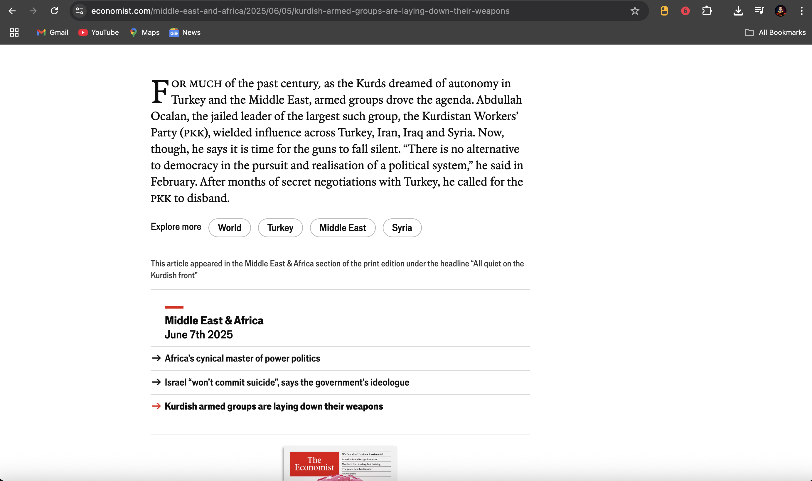

<h1 align="center">
  
   
  <strong>Economist Reader Cleaner</strong>
</h1>

  <i>✨ Clean. Unlock. Read Freely. ✨</i>

  

---

## 🚀 Overview

This Chrome extension is a custom-built tool that **removes paywalls and ads** from articles on [economist.com](https://economist.com), giving you an ad-free, clean reading experience.

I built this from scratch while exploring how Chrome extensions and DOM manipulation work. It’s lightweight, smooth, and does exactly what it says — unlocks your reading.

---

## 💡 Features

- 🔓 Unlocks premium content on economist.com  
- 🧼 Removes subscription overlays and ad containers  
- 🎯 Injects a floating animated card to confirm success  
- ⚡ Lightweight and auto-executes on supported pages  

---

## 🧠 Tech Stack

  
  
  

---

## 📁 Project Structure

📦 EconomistReaderCleaner/
├── manifest.json          # Extension config
├── main.js                # Core logic to clean the page
├── extenCard.css          # Floating animated card styles
└── static/
├── logo-16.png
├── logo-48.png
└── logo-128.png

---

## ⚙️ How to Install

> 💡 Works best in Chrome or Brave browser

1. Download or clone this repository
2. Go to `chrome://extensions/`
3. Turn on **Developer Mode** (top right)
4. Click **Load unpacked**
5. Select this project folder
6. Visit [https://www.economist.com](https://www.economist.com)

✅ That's it — the extension will auto-clean the page.

---

## 📷 Preview

  

---

## 🎯 My Learnings

- Chrome Extension fundamentals (manifest, content scripts)
- DOM parsing and rewriting using `innerHTML`
- Selecting and removing HTML elements like `.paywall`, `.advert`
- Creating animated UI components with CSS
- The power of manipulating live web pages 🤯

---

## 🚧 What’s Next?

- 🔘 Add toggle switch with popup.html  
- 🌐 Support more news websites  
- 🧪 Use MutationObserver to clean dynamic ads  
- 💬 Add user notifications or dark mode themes  

---

## 🖼️ Banner

  

---

## 🧠 Fun Fact

> I built this while I was just learning JavaScript basics — this project taught me more than any tutorial ever could!

---

  

